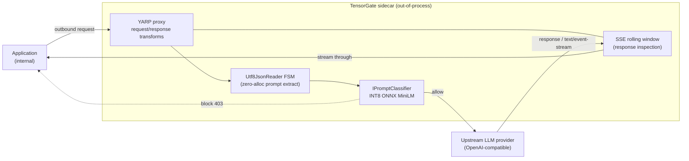

# TensorGate Architecture

TensorGate is an out-of-process, containerized **sidecar** that intercepts,
inspects, and gates Large Language Model (LLM) traffic in real time. It sits
between an application and its upstream LLM provider as a [YARP](https://github.com/microsoft/reverse-proxy)
reverse proxy, running local INT8 ONNX classification on pure CPU within a
sub-50ms end-to-end latency budget.

This document describes the system topology and the request/response data flow.
The rationale behind the major choices is recorded as
[Architecture Decision Records](adr/README.md).

## Deployment topology

TensorGate is deployed adjacent to the workload it protects (same pod / same host),
so all outbound LLM traffic is routed through it. No traffic reaches an upstream
provider without passing the classification gate.



If Mermaid is not rendered, the equivalent topology:

```text
┌──────────────┐   request    ┌───────────────────────────────────────────────┐   allow    ┌───────────────┐
│  Application  │ ───────────▶ │                TensorGate sidecar              │ ────────▶  │  LLM provider │
│  (internal)   │ ◀─────────── │                                                │ ◀────────  │  (upstream)   │
└──────────────┘  block (403) │  ┌────────┐   ┌────────────┐   ┌─────────────┐  │  response  └───────────────┘
                              │  │  YARP   │──▶│ Utf8Json   │──▶│  ONNX (INT8)│  │
                              │  │  proxy  │   │ Reader FSM │   │  MiniLM     │  │
                              │  └────────┘   └────────────┘   └─────────────┘  │
                              │       │  response: SSE rolling window (no buffer)│
                              └───────────────────────────────────────────────┘
```

## Components

| Component | Project | Responsibility |
|:----------|:--------|:---------------|
| Reverse proxy | `TensorGate.Proxy` | YARP host; routing, request/response transforms, `/health`. Config-driven via `appsettings.json`. |
| Prompt extraction | `TensorGate.Core` (`Json/`) | `Utf8JsonReader` state machine extracting prompt bytes with zero allocations ([ADR-0002](adr/0002-zero-allocation-utf8jsonreader.md)). |
| Classification seam | `TensorGate.Core` (`Classification/`) | `IPromptClassifier` over `ReadOnlySpan<byte>`; `AllowAllPromptClassifier` placeholder until the Sprint 2 ONNX engine ([ADR-0003](adr/0003-int8-onnx-cpu-inference.md)). |
| SSE preservation | `TensorGate.Core` (`Streaming/`) | `SseRollingWindow` + media-type detection; forwards `text/event-stream` without buffering the full response. |
| Mock upstream | `TensorGate.MockUpstream` | Test double standing in for an OpenAI-compatible provider (echo + SSE endpoints). |
| Tests | `TensorGate.Tests` | Unit + end-to-end integration tests across the proxy, FSM, and streaming paths. |

The solution targets **.NET 10** with the latest stable C# language version,
configured centrally via `Directory.Build.props`.

## Request path (outbound, synchronous gate)

1. **Interception** — YARP matches the inbound request to a route. The prompt
   classification request transform attaches only to routes carrying the
   `TensorGate.Classify` metadata flag, so non-classified routes keep zero-overhead
   pass-through ([ADR-0001](adr/0001-yarp-reverse-proxy.md)).
2. **Body capture** — On a classified route with an inspectable JSON body, the
   request body is buffered once.
3. **Zero-alloc extraction** — The `Utf8JsonReader` FSM extracts the prompt bytes
   from the buffered UTF-8 directly into an `IBufferWriter<byte>`, with no JSON DOM
   and no intermediate strings ([ADR-0002](adr/0002-zero-allocation-utf8jsonreader.md)).
4. **Classification** — `IPromptClassifier.Classify(ReadOnlySpan<byte>)` returns
   `Allow` or `Block`. Sprint 2 swaps the placeholder for INT8 ONNX MiniLM inference
   behind the same seam ([ADR-0003](adr/0003-int8-onnx-cpu-inference.md)).
5. **Decision gate:**
   - **Block** → the transform writes a structured `403` response and does not
     forward — the request never leaves the sidecar.
   - **Allow** → the consumed body is rewound onto `HttpContext.Request.Body` and
     YARP forwards the original payload upstream byte-for-byte.

## Response path (inbound, streaming)

LLM responses — particularly `text/event-stream` (SSE) token streams — are forwarded
**without buffering the full response**, preserving real-time streaming to the
caller. A forward-only `SseRollingWindow` inspects response content over a sliding
window rather than accumulating the whole body, so memory stays bounded and latency
is not gated on a complete response.

## Model lifecycle (Sprint 3)

The classification model can be hot-swapped with zero downtime. Session lifetime is
managed by a lock-free reference-counting disposal pattern (`RefCountDisposable`) so
an old `InferenceSession` is reclaimed deterministically only after the last in-flight
request releases it — never on a timed guess ([ADR-0004](adr/0004-refcountdisposable-model-lifecycle.md)).

## Performance budget

| Metric | Target | Mechanism |
|:-------|:-------|:----------|
| End-to-end latency | < 50 ms | INT8 quantization + AVX-512 VNNI |
| Inference latency | 8–12 ms | Static quantization, L3-resident weights |
| Heap allocations (hot path) | 0 bytes | `Span<T>`, `ArrayPool<T>`, `Utf8JsonReader` |
| Model memory | ~23 MB | INT8 weight compression |
| Model hot-reload | Zero downtime | Atomic `RefCountDisposable` double buffering |

## NIST AI RMF alignment

The architecture maps to the four pillars of [NIST AI 600-1](https://www.nist.gov/artificial-intelligence):

- **Govern** — policy-as-code in the classification gate; all LLM traffic inspected
  regardless of source (zero-trust proxy).
- **Map** — prompt extraction and classification identify adversarial inputs in context.
- **Measure** — adversarial validation (HarmBench) and benchmark gates quantify recall
  and latency.
- **Manage** — synchronous blocking and deterministic resource management contain risk
  before traffic reaches upstream providers.

## Sprint roadmap

| Sprint | Focus |
|:-------|:------|
| Sprint 1 | Foundational scaffolding & proxy mechanics (YARP, zero-alloc FSM, SSE preservation, classification seam) |
| Sprint 2 | Memory optimization & inference engines (tokenizer, INT8 ONNX MiniLM) |
| Sprint 3 | Concurrency, hot-swapping & adversarial validation (`RefCountDisposable`, HarmBench) |

See the [project board](https://github.com/orgs/TensorGateLabs/projects/1) for live status.
